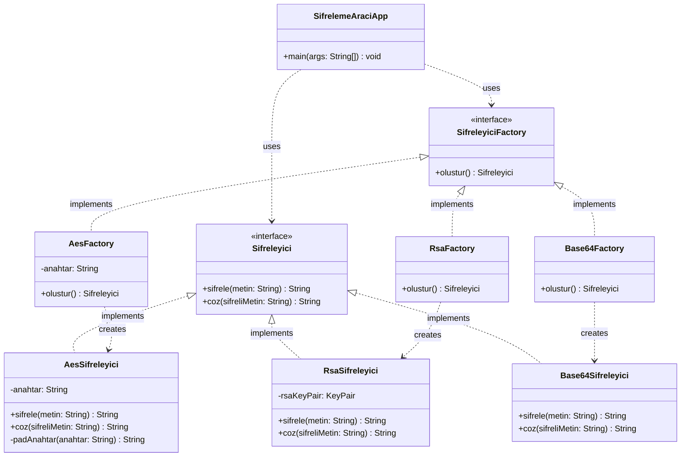

# Tasarım Örüntüleri Belgelemesi

## Faz 1: Creational (Yaratımsal) Örüntüler

> Projemizde yaptığımız tasarım düzeltmelerinin 'Gerekçesi' ,'Nasıl Uygulandığı' , 'Kullanılan Tasarım Örüntüleri'belgelenmiştir.

### 1. Factory Method (Fabrika Metodu) Örüntüsü

#### **A. Uygulama Noktası**

Factory Method örüntüsü, şifreleme algoritmalarının (`AesSifreleyici`, `RsaSifreleyici`, `Base64Sifreleyici`) nesne üretim süreçlerini standartlaştırmak amacıyla şu yapılar üzerinden kurgulanmıştır:

- **Ürün Arayüzü (Product):** `Sifreleyici` interface'i tanımlanarak tüm şifreleme sınıfları için ortak bir kontrat oluşturulmuştur.
- **Somut Ürünler (Concrete Products):** `AesSifreleyici`, `RsaSifreleyici` ve `Base64Sifreleyici` sınıfları bu arayüzü implemente ederek kendi iş mantıklarını (şifreleme/çözme) kapsüllemektedir.
- **Yaratıcı Arayüzü (Creator):** `SifreleyiciFactory` arayüzü, nesne üretim metodunu (`olustur()`) tanımlar.
- **Somut Yaratıcılar (Concrete Creators):** Her bir şifreleyici tipi için özel fabrikalar (`AesFactory`, `RsaFactory`, `Base64Factory`) oluşturulmuş ve nesne inşa süreçleri bu fabrikalara devredilmiştir.

#### **B. Uygulama Gerekçesi (Neden?)**

Faz-0 analizinde (`PROBLEMS.md`) tespit edilen kronik sorunlar, bu örüntünün seçilmesinde temel motivasyon kaynağı olmuştur:

1.  **God Class Sorunu:** `SifrelemeAraciApp` sınıfı hem kullanıcı arayüzünü yönetiyor, hem algoritma seçimi yapıyor, hem de şifreleme nesnelerini inşa ediyordu; bu durum Single Responsibility Principle (SRP) ihlaline neden oluyordu.
2.  **Sabit Kodlanmış Algoritmalar:** Başlangıç kodunda algoritma seçimi constructor içinde sabitlenmişti ve çalışma zamanında (runtime) bu seçimi değiştirmek mümkün değildi.
3.  **Genişletilebilirlik Engeli (OCP):** Yeni bir algoritma eklemek için ana uygulama kodunda yapısal değişiklikler yapılması gerekiyordu, bu durum Open/Closed Principle ile çelişiyordu.

#### **C. Elde Edilen Kazanımlar (Ne Kazandırdı?)**

- **Sorumlulukların Ayrıştırılması (Decoupling):** İstemci kod (`SifrelemeAraciApp`), artık hangi somut şifreleyici sınıfının örneklendiğiyle ilgilenmez, sadece `SifreleyiciFactory` arayüzü üzerinden talepte bulunur.
- **Esneklik:** Sisteme yeni bir şifreleme algoritması eklenmek istendiğinde, mevcut `main` akışında herhangi bir modifikasyon yapılmasına gerek kalmadan sadece yeni bir Factory sınıfı eklemek yeterli hale gelmiştir.
- **Merkezi Yapılandırma:** Nesne üretim parametreleri fabrikalar içinde yönetildiği için, sistemin geri kalanı bu detaylardan izole edilmiştir.
- **Kod Temizliği:** Uygulama içindeki karmaşık nesne inşa blokları temizlenerek kodun okunabilirliği ve bakımı kolaylaştırılmıştır.

---

#### **D. UML Sınıf Diyagramı (Faz-1 Sonrası)**

Aşağıdaki diyagram, Factory Method entegrasyonu sonrası sistemin nesne yönelimli yeni mimarisini ve arayüz bağımlılıklarını göstermektedir:

