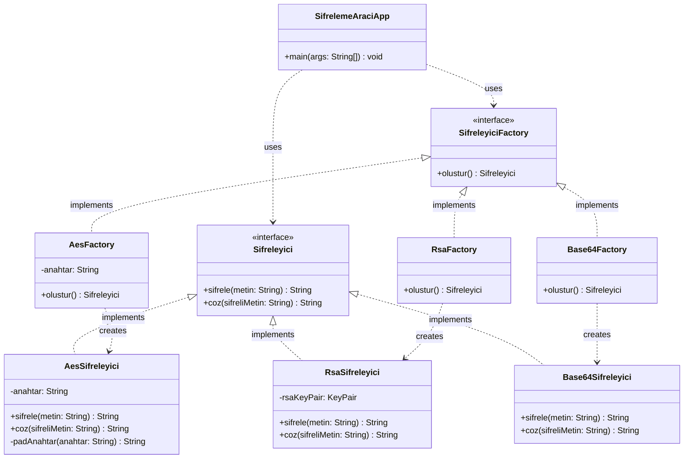
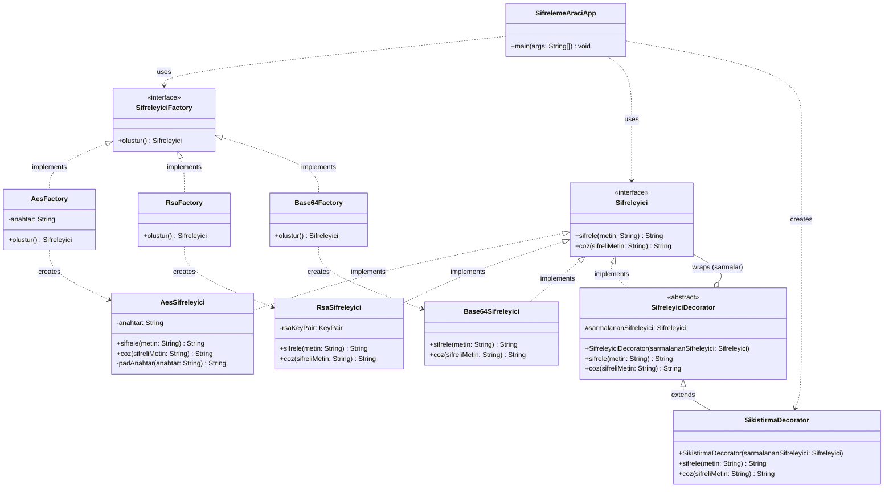
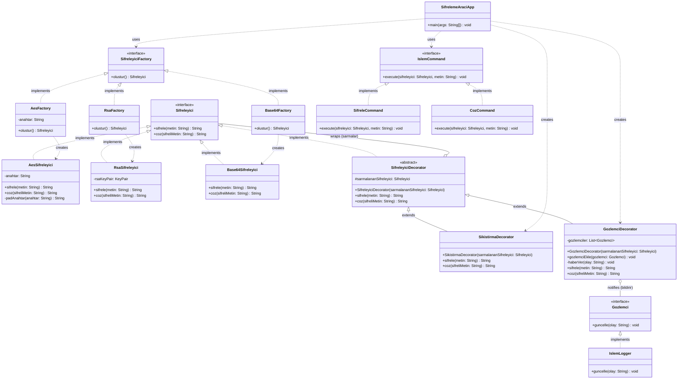

# Tasarım Örüntüleri Belgelemesi

## Faz 1: Creational (Yaratımsal) Örüntüler

> Projemizde yaptığımız tasarım düzeltmelerinin 'Gerekçesi' ,'Nasıl Uygulandığı' , 'Kullanılan Tasarım Örüntüleri'belgelenmiştir.

### 1. Factory Method (Fabrika Metodu) Örüntüsü

#### **A. Uygulama Noktası**

Factory Method örüntüsü, şifreleme algoritmalarının (`AesSifreleyici`, `RsaSifreleyici`, `Base64Sifreleyici`) nesne üretim süreçlerini standartlaştırmak amacıyla şu yapılar üzerinden kurgulanmıştır:

- **Ürün Arayüzü (Product):** `Sifreleyici` interface'i tanımlanarak tüm şifreleme sınıfları için ortak bir kontrat oluşturulmuştur.
- **Somut Ürünler (Concrete Products):** `AesSifreleyici`, `RsaSifreleyici` ve `Base64Sifreleyici` sınıfları bu arayüzü implemente ederek kendi iş mantıklarını (şifreleme/çözme) kapsüllemektedir.
- **Yaratıcı Arayüzü (Creator):** `SifreleyiciFactory` arayüzü, nesne üretim metodunu (`olustur()`) tanımlar.
- **Somut Yaratıcılar (Concrete Creators):** Her bir şifreleyici tipi için özel fabrikalar (`AesFactory`, `RsaFactory`, `Base64Factory`) oluşturulmuş ve nesne inşa süreçleri bu fabrikalara devredilmiştir.

#### **B. Uygulama Gerekçesi (Neden?)**

Faz-0 analizinde (`PROBLEMS.md`) tespit edilen kronik sorunlar, bu örüntünün seçilmesinde temel motivasyon kaynağı olmuştur:

1.  **God Class Sorunu:** `SifrelemeAraciApp` sınıfı hem kullanıcı arayüzünü yönetiyor, hem algoritma seçimi yapıyor, hem de şifreleme nesnelerini inşa ediyordu; bu durum Single Responsibility Principle (SRP) ihlaline neden oluyordu.
2.  **Sabit Kodlanmış Algoritmalar:** Başlangıç kodunda algoritma seçimi constructor içinde sabitlenmişti ve çalışma zamanında (runtime) bu seçimi değiştirmek mümkün değildi.
3.  **Genişletilebilirlik Engeli (OCP):** Yeni bir algoritma eklemek için ana uygulama kodunda yapısal değişiklikler yapılması gerekiyordu, bu durum Open/Closed Principle ile çelişiyordu.

#### **C. Elde Edilen Kazanımlar (Ne Kazandırdı?)**

- **Sorumlulukların Ayrıştırılması (Decoupling):** İstemci kod (`SifrelemeAraciApp`), artık hangi somut şifreleyici sınıfının örneklendiğiyle ilgilenmez, sadece `SifreleyiciFactory` arayüzü üzerinden talepte bulunur.
- **Esneklik:** Sisteme yeni bir şifreleme algoritması eklenmek istendiğinde, mevcut `main` akışında herhangi bir modifikasyon yapılmasına gerek kalmadan sadece yeni bir Factory sınıfı eklemek yeterli hale gelmiştir.
- **Merkezi Yapılandırma:** Nesne üretim parametreleri fabrikalar içinde yönetildiği için, sistemin geri kalanı bu detaylardan izole edilmiştir.
- **Kod Temizliği:** Uygulama içindeki karmaşık nesne inşa blokları temizlenerek kodun okunabilirliği ve bakımı kolaylaştırılmıştır.

#### **D. UML Sınıf Diyagramı (Faz-1 Sonrası)**

Aşağıdaki diyagram, Factory Method entegrasyonu sonrası sistemin nesne yönelimli yeni mimarisini ve arayüz bağımlılıklarını göstermektedir:

---

## Faz 2: Structural (Yapısal) Örüntüler

> Faz 2 kapsamında sistemin var olan çalışma mantığını (şifreleme sınıflarını) değiştirmeden, sisteme "sıkıştırma" özelliği kazandırılmış ve yapısal bir örüntü uygulanmıştır.

### 1. Decorator (Dekoratör) Örüntüsü

#### **A. Uygulama Noktası**

Uygulamamızda metinlerin şifrelenmeden önce sıkıştırılması (GZIP) ihtiyacı doğduğunda, bu özelliği mevcut şifreleyici sınıflara dinamik olarak eklemek için Decorator örüntüsü kullanılmıştır:

- **Bileşen Arayüzü (Component):** `Sifreleyici` arayüzü temel bileşen olarak kullanılmaya devam edilmiştir.
- **Soyut Dekoratör (Base Decorator):** `SifreleyiciDecorator` adında soyut bir sınıf oluşturulmuştur. Bu sınıf `Sifreleyici` arayüzünü uygular ve içinde sarmalayacağı bir `Sifreleyici` referansı tutar.
- **Somut Dekoratör (Concrete Decorator):** `SikistirmaDecorator` sınıfı oluşturulmuş, `sifrele()` metodunda önce GZIP sıkıştırması yapıp ardından sarmalanan nesneye şifreleme işlemi devredilmiştir. `coz()` metodunda ise tam tersi sıra izlenmiştir.

#### **B. Uygulama Gerekçesi (Neden?)**

Açık/Kapalı Prensibi (Open/Closed Principle - OCP) temel motivasyonumuz olmuştur. Sıkıştırma özelliğini AES, RSA veya Base64 sınıflarının içine doğrudan yazsaydık kod tekrarı oluşacak ve Single Responsibility (Tek Sorumluluk) prensibi çökecekti. Uygulamaya yeni yetenekler kazandırırken var olan, çalışan ve test edilmiş ana kodları (şifreleyicileri) değiştirmemek ama yeni özellikleri dışarıdan dinamik olarak ekleyebilmek için bu örüntü seçilmiştir.

#### **C. Elde Edilen Kazanımlar (Ne Kazandırdı?)**

- **Sorumlulukların Ayrışması:** Sıkıştırma mantığı ile şifreleme mantığı mimari düzeyde tamamen birbirinden ayrılmıştır.
- **Çalışma Zamanı (Runtime) Esnekliği:** Sıkıştırma özelliği sadece kullanıcı ana menüde "Evet" (E) seçeneğini seçtiğinde devreye girer. İstemci kod, bir nesneyi sıkıştırma sarmalına alıp almayacağına derleme zamanında değil, çalışma zamanında esnekçe karar verir.
- **Hiyerarşik Büyümenin Engellenmesi:** SıkıştırmalıAES, SıkıştırmasızAES, SıkıştırmalıRSA gibi gereksiz, yönetilemez ve devasa alt sınıf patlamalarının (class explosion) önüne kalıcı olarak geçilmiştir.

#### **D. UML Sınıf Diyagramı (Faz-2 Sonrası)**

Aşağıdaki diyagram, Factory Method ve Decorator örüntülerinin entegrasyonu sonrası sistemin nesne yönelimli yeni bütünsel mimarisini ve arayüz bağımlılıklarını göstermektedir:

---

## Faz 3: Behavioral (Davranışsal) Örüntüler

> Faz 3 kapsamında sistemin çalışan mimarisine dokunulmadan, kullanıcı işlemleri komut nesneleriyle soyutlanmış ve şifreleme işlemleri gözlemci mekanizmasıyla izlenebilir hâle getirilmiştir. Bu fazda iki davranışsal örüntü uygulanmıştır.

---

### 1. Command (Komut) Örüntüsü

#### **A. Uygulama Noktası**

Command örüntüsü, kullanıcının seçtiği işlemin (şifreleme veya çözme) uygulama akışından soyutlanması amacıyla şu yapılar üzerinden kurgulanmıştır:

- **Komut Arayüzü (Command):** `IslemCommand` arayüzü tanımlanarak tüm işlem sınıfları için `execute(Sifreleyici sifreleyici, String metin)` kontratı oluşturulmuştur.
- **Somut Komutlar (Concrete Commands):** `SifreleCommand` sınıfı `sifrele()`, `CozCommand` sınıfı ise `coz()` çağrısını kapsülleyerek kendi iş mantıklarını birer nesneye dönüştürmüştür.
- **Çağırıcı (Invoker):** `SifrelemeAraciApp`, kullanıcı girdisine karşılık gelen komutları bir `Map<String, IslemCommand>` yapısında tutmakta ve çalışma zamanında `secilenKomut.execute(sifreleyici, metin)` çağrısıyla tetiklemektedir.
- **Alıcı (Receiver):** `Sifreleyici` arayüzünü implemente eden somut şifreleyici sınıflar, asıl iş mantığını barındıran alıcı rolünü üstlenmektedir.

#### **B. Uygulama Gerekçesi (Neden?)**

Bu örüntünün seçilmesinde işlem seçim mantığının yarattığı yapısal sorunlar belirleyici olmuştur:

1. **Dağınık Koşul Blokları:** Şifreleme veya çözme işleminin seçimi önceden `if-else` dallanmalarıyla `SifrelemeAraciApp` içine gömülüydü; işlem seçimi ile işlem yürütme mantığı aynı yerde iç içe geçmişti.
2. **Single Responsibility Principle (SRP) İhlali:** `SifrelemeAraciApp`, hem kullanıcı arayüzünü yönetiyor hem de her işlemin ne yapacağını doğrudan biliyor ve yürütüyordu; bu durum sınıfın birden fazla değişim nedenine sahip olmasına yol açıyordu.
3. **Genişletilebilirlik Engeli (OCP):** Sisteme yeni bir işlem tipi (örneğin `YenidensiFreleCommand`) eklenmek istendiğinde mevcut `main` akışında yapısal değişiklikler yapılması kaçınılmazdı.

#### **C. Elde Edilen Kazanımlar (Ne Kazandırdı?)**

- **Sorumlulukların Ayrıştırılması (Decoupling):** `SifrelemeAraciApp` artık komutların ne yaptığını bilmez; sadece `Map` üzerinden ilgili komutu bulur ve `execute()` metodunu çağırır. İşlem mantığı tamamen komut nesnelerine devredilmiştir.
- **`if-else` Zincirinin Tasfiyesi:** Komutların `HashMap` üzerinden dispatch edilmesiyle birlikte dal sayısı arttıkça yönetilemez hale gelecek koşul blokları mimari düzeyde ortadan kaldırılmıştır.
- **Esneklik:** Sisteme yeni bir işlem eklemek için yalnızca `IslemCommand` arayüzünü implemente eden yeni bir sınıf yazmak yeterlidir; mevcut `main` akışında herhangi bir değişiklik gerekmemektedir.
- **Test Edilebilirlik:** Her komut bağımsız bir sınıf olduğundan, şifreleme altyapısından yalıtılmış biçimde birim testine tabi tutulabilir.

---

### 2. Observer (Gözlemci) Örüntüsü

#### **A. Uygulama Noktası**

Observer örüntüsü, şifreleme ve çözme işlemlerinin dışarıdan izlenebilmesi (loglama) ihtiyacına karşılık vermek üzere şu yapılar üzerinden kurgulanmıştır:

- **Gözlemci Arayüzü (Observer):** `Gozlemci` arayüzü, `guncelle(String olay)` metodunu tanımlayan bildirim kontratıdır.
- **Somut Gözlemci (Concrete Observer):** `IslemLogger` sınıfı bu arayüzü implemente ederek gelen olayları `[LOG]` önekiyle konsola yazdırmaktadır.
- **Özne/Konu (Subject):** `GozlemciDecorator` sınıfı, bir `List<Gozlemci>` koleksiyonu tutmakta; `gozlemciEkle()` metoduyla abonelik yönetimini, `haberVer()` metoduyla da tüm kayıtlı gözlemcilere olay yayınını üstlenmektedir.
- **Decorator Altyapısıyla Entegrasyon:** `GozlemciDecorator`, `SifreleyiciDecorator`'dan türetilmiştir. `sifrele()` ve `coz()` metodlarını ezererek (override) işlem öncesinde ve sonrasında `haberVer()` çağrısını tetikler; ardından sarmalanan asıl işi `super` aracılığıyla devretir. Bu tasarım sayesinde Observer mekanizması, Faz-2'de kurulan Decorator zinciriyle tam uyumlu biçimde entegre edilmiştir.

#### **B. Uygulama Gerekçesi (Neden?)**

Loglama, sistemi yatay kesen (cross-cutting concern) bir sorumluluktur. Bu sorumluluğun nasıl yerleştirileceği konusunda iki kötü alternatif söz konusuydu:

1. **Şifreleyici Sınıflarına Loglama Gömmek:** `AesSifreleyici`, `RsaSifreleyici` gibi sınıfların içine doğrudan `System.out.println` veya logger çağrısı yazmak hem Single Responsibility Principle'ı çökertir hem de loglama davranışını değiştirmek için çalışan şifreleme koduna dokunmayı zorunlu kılar; bu durum Open/Closed Principle ile çelişir.
2. **`SifrelemeAraciApp` İçinde Loglama Yapmak:** Tüm log çağrılarını ana uygulama akışına serpiştirmek God Class sorununu yeniden doğurur ve test edilebilirliği zedeler.

Her iki alternatifin yarattığı sorunlardan kaçınmak ve loglama mantığını şifreleme mantığından mimari düzeyde yalıtmak amacıyla Observer örüntüsü tercih edilmiştir.

#### **C. Elde Edilen Kazanımlar (Ne Kazandırdı?)**

- **Sorumlulukların Ayrışması:** Loglama mantığı `IslemLogger`'da, şifreleme mantığı ise ilgili şifreleyici sınıflarında kalmaktadır; iki sorumluluk hiçbir noktada kesişmemektedir.
- **Çalışma Zamanı (Runtime) Esnekliği:** Sisteme yeni bir gözlemci tipi (örneğin bir `AuditLogger` veya `MetrikToplayici`) eklemek için mevcut hiçbir sınıfa dokunmaya gerek yoktur; yalnızca `Gozlemci` arayüzünü implemente eden yeni bir sınıf yazıp `gozlemciEkle()` ile kaydettirmek yeterlidir.
- **Decorator Altyapısının Yeniden Kullanımı:** `GozlemciDecorator`'ın `SifreleyiciDecorator`'dan türetilmesi, Observer mekanizmasını mevcut decorator zincirine sorunsuz biçimde eklemiştir. `SifrelemeAraciApp`'ta kurulan `SikistirmaDecorator → GozlemciDecorator → ConcreteŞifreleyici` zinciri, tüm katmanların `Sifreleyici` arayüzü üzerinden birbirine bağlandığı tutarlı ve yönetilebilir bir mimari oluşturmaktadır.
- **Gevşek Bağlılık (Loose Coupling):** `GozlemciDecorator`, gözlemcilerinin kim olduğunu ve ne yaptığını bilmez; yalnızca `Gozlemci` arayüzünü çağırır. Bu sayede gözlemci ve özne tamamen birbirinden bağımsız geliştirilebilir.

#### **D. UML Sınıf Diyagramı (Faz-3 Sonrası)**

Aşağıdaki diyagram, Factory Method, Decorator, Command ve Observer örüntülerinin tamamının entegrasyonu sonrası sistemin nesne yönelimli bütünsel mimarisini ve tüm arayüz bağımlılıklarını göstermektedir:

