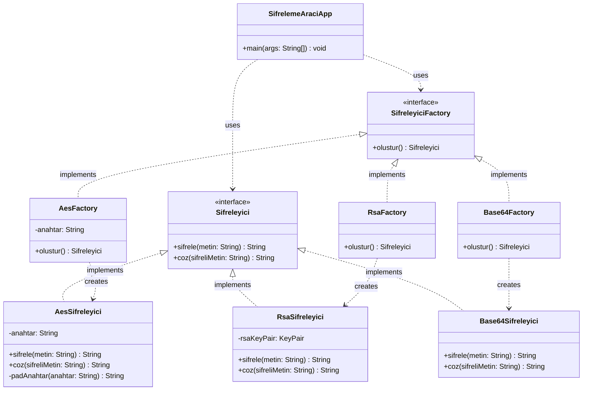
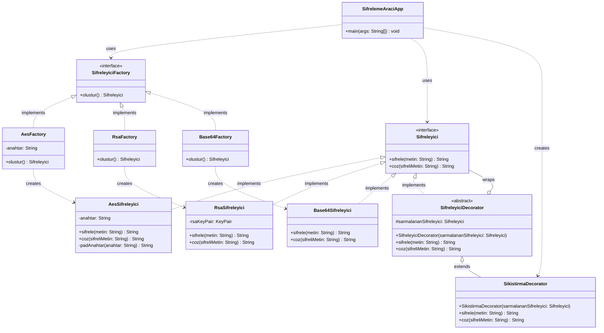
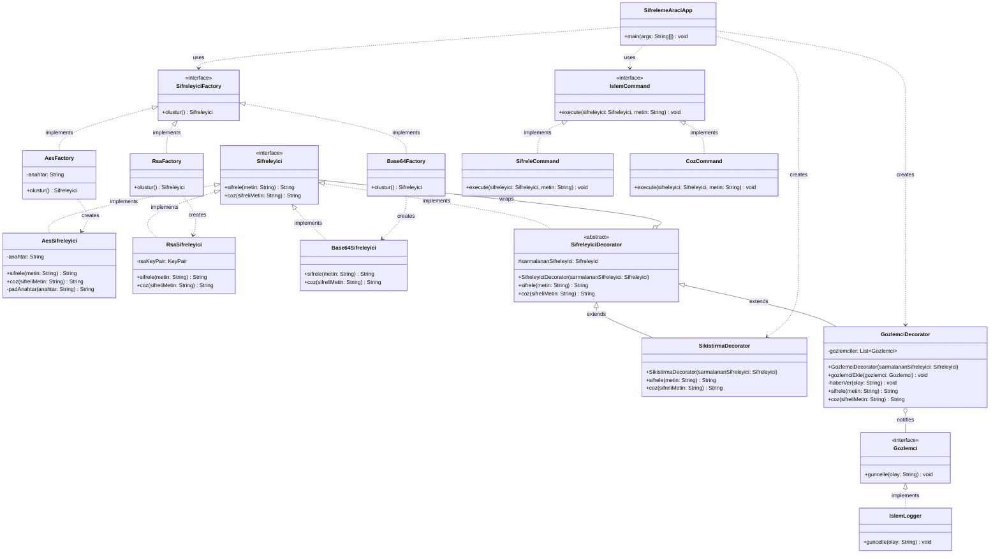

# Tasarım Örüntüleri Ödevi

Konya Teknik Üniversitesi | Yazılım Tasarım Örüntüleri Ödevi: Evrimleşen Sistem (Seçenek E: Şifreleme Aracı) — 2025-2026

**Seçilen Konu:** E - Şifreleme Aracı

> **Gerekçe:**
>
> Konu seçenekleri arasında şifreleme algoritmalarını görmek istemsizce bu seçeneğe yönelmeme neden oldu; çünkü veri güvenliği mekanizmalarının arka planı her zaman temel ilgi alanlarımdan biri olmuştur. Farklı algoritmaların sabit kodlamadan kurtarılarak sisteme esnek ve dinamik bir şekilde entegre edilmesini, doğrudan bu kişisel motivasyon üzerinden deneyimlemeyi hedefliyorum.

---

## Projenin Ne Yaptığı

Bu proje; AES, RSA ve Base64 algoritmalarını destekleyen bir komut satırı şifreleme aracıdır. Kullanıcı bir algoritma seçer, metin girer ve şifreleme ya da çözme işlemi gerçekleştirir. İsteğe bağlı olarak işlem öncesinde GZIP sıkıştırması uygulanabilir; tüm işlemler otomatik olarak loglanır.

Projenin asıl amacı çalışan bir şifreleme servisi sunmak değil, **evrimleşen bir sistemi** üç faz boyunca tasarım örüntüleriyle yeniden yapılandırmaktır. Başlangıçta tek bir God Class'ta toplanmış olan kod; Creational, Structural ve Behavioral örüntüler ile fazlar boyunca esnek, genişletilebilir ve SOLID uyumlu bir mimariye dönüştürülmüştür.

---

## Nasıl Çalıştırılır

**Gereksinim:** Java 17 veya üzeri

```bash
# Proje kök dizininde derleme
javac -d bin src/sifreleme/*.java

# Çalıştırma
java -cp bin sifreleme.SifrelemeAraciApp
```

**Kullanım Akışı:**

1. Algoritma seçin: `AES`, `RSA` veya `BASE64`
2. AES seçtiyseniz anahtar girin
3. İşlem seçin: `1` (Şifrele) veya `2` (Çöz)
4. Metni girin
5. Sıkıştırma tercihinizi belirtin: `E` (Evet) veya `H` (Hayır)
6. Programdan çıkmak için `CIKIS` yazın

---

## Kullanılan Tasarım Örüntüleri

### Faz 1 — Factory Method (Creational)

`SifreleyiciFactory` arayüzü ve `AesFactory`, `RsaFactory`, `Base64Factory` somut fabrikaları üzerinden uygulandı. Başlangıç kodundaki God Class sorununu çözmek, nesne üretim sorumluluğunu `SifrelemeAraciApp`'tan ayırmak ve yeni algoritma eklendiğinde mevcut koda dokunulmaması (OCP) için seçildi.

### Faz 2 — Decorator (Structural)

`SifreleyiciDecorator` soyut sınıfı ve `SikistirmaDecorator` somut dekoratörü üzerinden uygulandı. Mevcut şifreleyici sınıflara hiç dokunmadan GZIP sıkıştırma özelliğini dinamik olarak sisteme eklemek ve sınıf patlamasının (class explosion) önüne geçmek için seçildi.

### Faz 3 — Command (Behavioral)

`IslemCommand` arayüzü, `SifreleCommand` ve `CozCommand` somut sınıfları üzerinden uygulandı. `SifrelemeAraciApp` içindeki `if-else` zincirini tasfiye etmek, işlem mantığını uygulama akışından ayırmak ve yeni işlem tipleri eklenirken mevcut koda dokunulmaması (OCP) için seçildi.

### Faz 3 — Observer (Behavioral)

`Gozlemci` arayüzü, `IslemLogger` somut sınıfı ve `GozlemciDecorator` üzerinden uygulandı. Faz 2'deki Decorator altyapısı genişletilerek loglama mekanizması sisteme dışarıdan eklendi. Şifreleme sınıflarına dokunmadan loglama sorumluluğunu şifreleme sorumluluğundan yalıtmak (SRP + OCP) için seçildi.

---

## Başlangıç Sorunlarının Kapanış Tablosu

| PROBLEMS.md Sorunu             | Kapandığı Faz | Uygulanan Çözüm                                                             |
| ------------------------------ | ------------- | --------------------------------------------------------------------------- |
| God Class                      | Faz 1 + Faz 3 | Factory (nesne üretimi ayrıştırıldı) + Command (işlem mantığı ayrıştırıldı) |
| Kod Tekrarı                    | Faz 1         | Her algoritma kendi sınıfına taşındı                                        |
| RSA Anahtar Yönetimi Hatası    | Faz 1         | `KeyPair` `RsaSifreleyici` constructor'ında bir kez üretilir                |
| If-Else Zinciri (OCP İhlali)   | Faz 3         | `Map<String, IslemCommand>` dispatch mekanizması                            |
| Sabit Kodlanmış Algoritma      | Faz 1         | Factory Method ile runtime seçimi                                           |
| String Tabanlı Tip Güvenliği   | Faz 1         | `Sifreleyici` arayüzü ile polimorfik yapı                                   |
| Hata Yönetimi Gizleniyor       | Faz 2         | `SifrelemeException` ile merkezi hata yönetimi                              |
| Platform Bağımlılığı (Charset) | Faz 2 + Faz 3 | `StandardCharsets.UTF_8` tüm sınıflarda standartlaştırıldı                  |

---

## Mimari Diyagramlar

### Faz 1 — Factory Method



---

### Faz 2 — Decorator



---

### Faz 3 — Command + Observer


