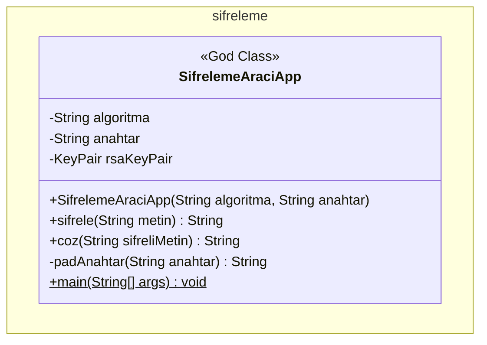

```mermaid
classDiagram
    namespace sifreleme {
        class SifrelemeAraciApp {
            <<God Class>>
            -String algoritma
            -String anahtar
            -KeyPair rsaKeyPair
            +SifrelemeAraciApp(String algoritma, String anahtar)
            +sifrele(String metin) String
            +coz(String sifreliMetin) String
            -padAnahtar(String anahtar) String
            +main(String[] args)$ void
        }
    }
```
