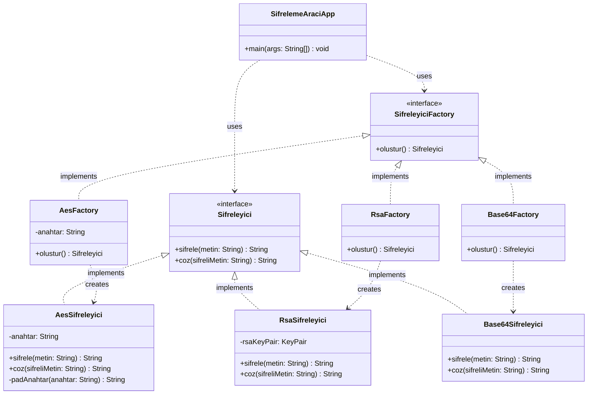

```mermaid
classDiagram
    class Sifreleyici {
        <<interface>>
        +sifrele(metin: String) String
        +coz(sifreliMetin: String) String
    }

    class AesSifreleyici {
        -anahtar: String
        +sifrele(metin: String) String
        +coz(sifreliMetin: String) String
        -padAnahtar(anahtar: String) String
    }

    class RsaSifreleyici {
        -rsaKeyPair: KeyPair
        +sifrele(metin: String) String
        +coz(sifreliMetin: String) String
    }

    class Base64Sifreleyici {
        +sifrele(metin: String) String
        +coz(sifreliMetin: String) String
    }

    class SifreleyiciFactory {
        <<interface>>
        +olustur() Sifreleyici
    }

    class AesFactory {
        -anahtar: String
        +olustur() Sifreleyici
    }

    class RsaFactory {
        +olustur() Sifreleyici
    }

    class Base64Factory {
        +olustur() Sifreleyici
    }

    class SifrelemeAraciApp {
        +main(args: String[]) void
    }

    %% Ürün (Product) Hiyerarşisi
    Sifreleyici <|.. AesSifreleyici : implements
    Sifreleyici <|.. RsaSifreleyici : implements
    Sifreleyici <|.. Base64Sifreleyici : implements

    %% Yaratıcı (Creator) Hiyerarşisi
    SifreleyiciFactory <|.. AesFactory : implements
    SifreleyiciFactory <|.. RsaFactory : implements
    SifreleyiciFactory <|.. Base64Factory : implements

    %% İlişkiler
    AesFactory ..> AesSifreleyici : creates
    RsaFactory ..> RsaSifreleyici : creates
    Base64Factory ..> Base64Sifreleyici : creates
    SifrelemeAraciApp ..> SifreleyiciFactory : uses
    SifrelemeAraciApp ..> Sifreleyici : uses
```
