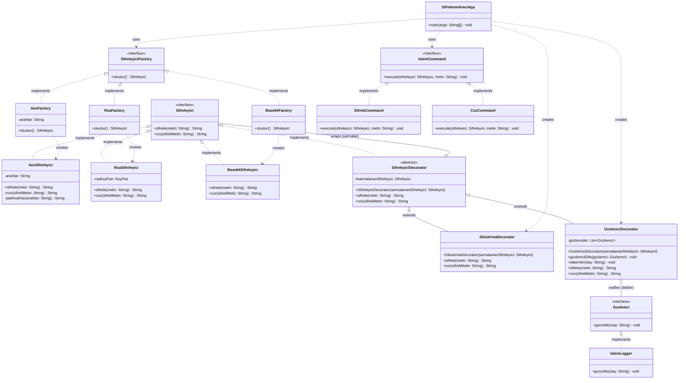

```mermaid
classDiagram
    class Sifreleyici {
        <<interface>>
        +sifrele(metin: String) String
        +coz(sifreliMetin: String) String
    }

    class AesSifreleyici {
        -anahtar: String
        +sifrele(metin: String) String
        +coz(sifreliMetin: String) String
        -padAnahtar(anahtar: String) String
    }

    class RsaSifreleyici {
        -rsaKeyPair: KeyPair
        +sifrele(metin: String) String
        +coz(sifreliMetin: String) String
    }

    class Base64Sifreleyici {
        +sifrele(metin: String) String
        +coz(sifreliMetin: String) String
    }

    class SifreleyiciDecorator {
        <<abstract>>
        #sarmalananSifreleyici: Sifreleyici
        +SifreleyiciDecorator(sarmalananSifreleyici: Sifreleyici)
        +sifrele(metin: String) String
        +coz(sifreliMetin: String) String
    }

    class SikistirmaDecorator {
        +SikistirmaDecorator(sarmalananSifreleyici: Sifreleyici)
        +sifrele(metin: String) String
        +coz(sifreliMetin: String) String
    }

    class GozlemciDecorator {
        -gozlemciler: List~Gozlemci~
        +GozlemciDecorator(sarmalananSifreleyici: Sifreleyici)
        +gozlemciEkle(gozlemci: Gozlemci) void
        -haberVer(olay: String) void
        +sifrele(metin: String) String
        +coz(sifreliMetin: String) String
    }

    class Gozlemci {
        <<interface>>
        +guncelle(olay: String) void
    }

    class IslemLogger {
        +guncelle(olay: String) void
    }

    class SifreleyiciFactory {
        <<interface>>
        +olustur() Sifreleyici
    }

    class AesFactory {
        -anahtar: String
        +olustur() Sifreleyici
    }

    class RsaFactory {
        +olustur() Sifreleyici
    }

    class Base64Factory {
        +olustur() Sifreleyici
    }

    class IslemCommand {
        <<interface>>
        +execute(sifreleyici: Sifreleyici, metin: String) void
    }

    class SifreleCommand {
        +execute(sifreleyici: Sifreleyici, metin: String) void
    }

    class CozCommand {
        +execute(sifreleyici: Sifreleyici, metin: String) void
    }

    class SifrelemeAraciApp {
        +main(args: String[]) void
    }

    %% Ürün (Product) Hiyerarşisi
    Sifreleyici <|.. AesSifreleyici : implements
    Sifreleyici <|.. RsaSifreleyici : implements
    Sifreleyici <|.. Base64Sifreleyici : implements

    %% Yapısal (Decorator) Örüntü Hiyerarşisi
    Sifreleyici <|.. SifreleyiciDecorator : implements
    SifreleyiciDecorator o-- Sifreleyici : wraps (sarmalar)
    SifreleyiciDecorator <|-- SikistirmaDecorator : extends
    SifreleyiciDecorator <|-- GozlemciDecorator : extends

    %% Davranışsal (Observer) Örüntü Hiyerarşisi
    Gozlemci <|.. IslemLogger : implements
    GozlemciDecorator o-- Gozlemci : notifies (bildirir)

    %% Yaratıcı (Creator) Hiyerarşisi
    SifreleyiciFactory <|.. AesFactory : implements
    SifreleyiciFactory <|.. RsaFactory : implements
    SifreleyiciFactory <|.. Base64Factory : implements

    %% Davranışsal (Command) Örüntü Hiyerarşisi
    IslemCommand <|.. SifreleCommand : implements
    IslemCommand <|.. CozCommand : implements

    %% İlişkiler
    AesFactory ..> AesSifreleyici : creates
    RsaFactory ..> RsaSifreleyici : creates
    Base64Factory ..> Base64Sifreleyici : creates
    SifrelemeAraciApp ..> SifreleyiciFactory : uses
    SifrelemeAraciApp ..> IslemCommand : uses
    SifrelemeAraciApp ..> GozlemciDecorator : creates
    SifrelemeAraciApp ..> SikistirmaDecorator : creates
```
